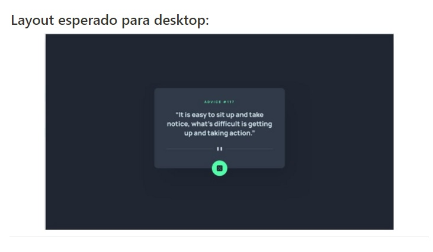
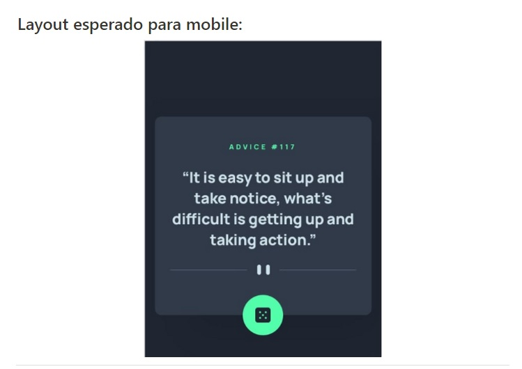
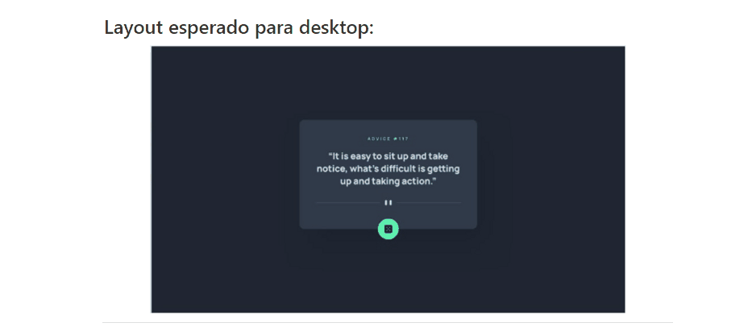
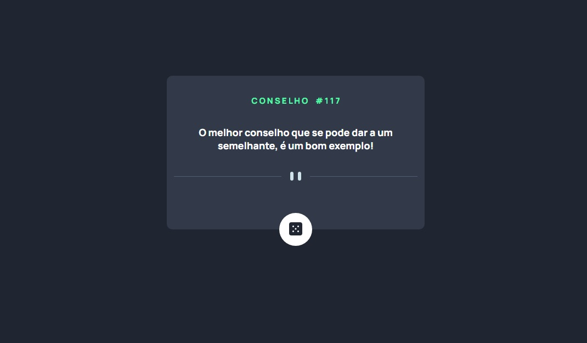
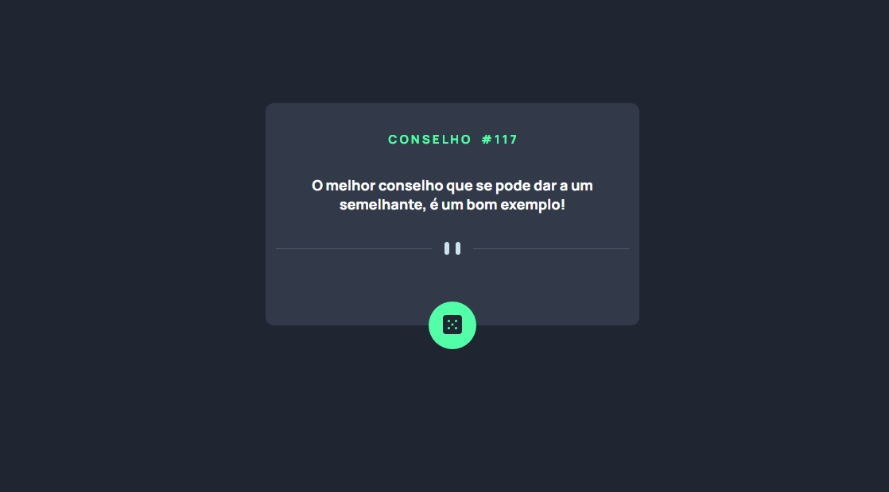
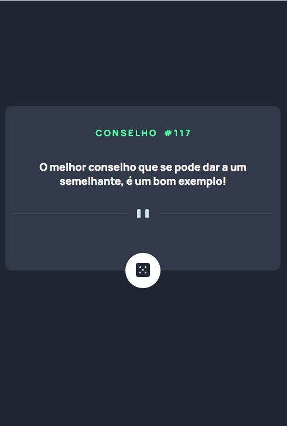

# README - Exercício Avançado CSS - FLEX - 03 - Gerador Conselhos
Estudo de caso FLEX. Desenvolvimento de Layout de Gerador de Conselhos. Usamos no projeto linguagem HTML e CSS. Fizemos um projeto responsivo, levando-se em consideração o uso do mesmo site em dispositivos móveis ou dispositivos com telas pequenas. 🚀🚀 

Abaixo estão as imagens e gif´s do site que foi reproduzido:

[]

[]

- GIF Layout´s Esperados
[]

Abaixo estão as imagens dos layout´s feita por mim. Tentei ser o mais fiel possível:

- Sem Pressionar o Botão
[]

- Botão Pressionado
[]

- Layout Mobile
[]

## Tecnologias Utilizadas
- HTML
- CSS

## Desafios
Tivemos dificuldade para adequar a quebra de linha utilizada entre a frase e o botão, pois, quando visualizávamos o layout em uma tela menor, a quebra de linha assumia uma estilização diversa da mostrada na imagem do modelo.
Resolvemos referido desafio usando a TAG PICTURE no HTML, mesmo sabendo que alguns navegadores ainda não dão suporte a referida TAG.
